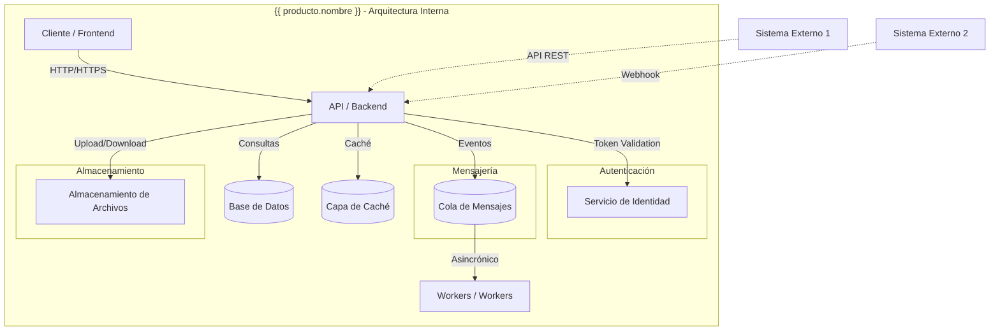

# Diagrama de Arquitectura: {{ producto.nombre }}

**Tipo de Producto:** {{ producto.tipo }}  
**Versión:** {{ producto.version | default:"v1.0.0" }}

---

## 1. Diagrama de Contexto (C4 - Level 0)

```mermaid
graph TB
    subgraph Sistema["{{ producto.nombre }}"]
        A[{{ producto.nombre }} - Core] --> B[Base de Datos]
        A --> C[API Gateway / Servidor]
    end

    Usuario((Usuario)) -->|Interactúa con| Sistema
    ServiciosExternos((Servicios Externos)) -->|Integra con| Sistema
```

---

## 2. Diagrama de Componentes (C4 - Level 1)



---

## 3. Notas

- **Actores externos** (en el recuadro redondeado) representan entidades fuera del sistema que interactúan con él.
- **Servicios principales** (dentro del recuadro del sistema) representan los componentes internos.
- Adaptar los componentes según el tipo de producto:
  - **Web/Móvil:** Incluir Frontend, Backend, Base de Datos.
  - **API:** Incluir API Gateway, Servicios, Base de Datos, Auth.
  - **CLI/Escritorio:** Incluir Aplicación, Base de Datos local, Servicios remotos.
