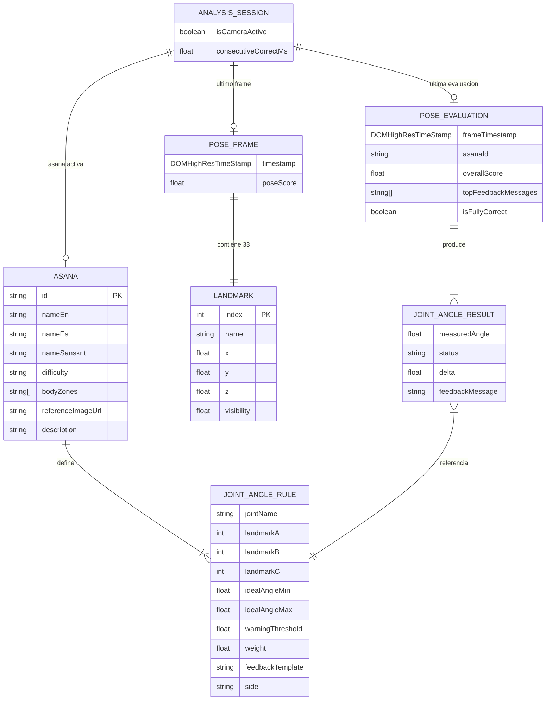

# DOMAIN: DrishtiPosture

> Modelo de dominio conceptual y estructuras de datos del cliente.  
> No existe base de datos persistente. Todo el estado es efímero (en memoria por sesión de navegador).

---

## 1. Modelo de Dominio Conceptual

### 1.1 Descripción del Sistema

DrishtiPosture es un sistema de análisis postural de yoga en tiempo real que opera completamente en el lado del cliente (navegador). El dominio gira en torno a tres conceptos fundamentales:

1. **Pose (Asana):** La postura de yoga que el usuario desea practicar, definida por un conjunto de reglas de ángulos articulares.
2. **PoseDetection:** El resultado del análisis de MediaPipe Pose en un frame de video: los 33 landmarks del cuerpo con sus coordenadas y visibilidad.
3. **PoseEvaluation:** La comparación entre el estado corporal detectado y las reglas de la asana activa, que produce el feedback visual y textual.

---

### 1.2 Entidades del Dominio

#### `Asana`
Representa una postura de yoga del catálogo. Define el conjunto de reglas angulares que determinan si la postura es correcta.

**Atributos:**

| Atributo | Tipo | Descripción |
| :--- | :--- | :--- |
| `id` | `string` | Identificador único de la asana (ej. `"warrior-i"`) |
| `nameEn` | `string` | Nombre en inglés (ej. `"Warrior I"`) |
| `nameEs` | `string` | Nombre en español (ej. `"Guerrero I"`) |
| `nameSanskrit` | `string` | Nombre en sánscrito (ej. `"Virabhadrasana I"`) |
| `difficulty` | `"beginner" \| "intermediate" \| "advanced"` | Nivel de dificultad |
| `bodyZones` | `BodyZone[]` | Zonas del cuerpo trabajadas (ej. `["legs", "core", "arms"]`) |
| `referenceImageUrl` | `string` | URL relativa a la imagen de referencia en el bundle |
| `description` | `string` | Descripción breve de la asana |
| `jointRules` | `JointAngleRule[]` | Lista de reglas angulares que definen la postura correcta |

**Cardinalidad:** Una `Asana` tiene **1..N** `JointAngleRule`.

---

#### `JointAngleRule`
Define el rango de ángulo ideal para una articulación específica dentro de una asana. Es la unidad mínima de evaluación postural.

**Atributos:**

| Atributo | Tipo | Descripción |
| :--- | :--- | :--- |
| `jointName` | `string` | Nombre legible de la articulación (ej. `"Rodilla derecha"`) |
| `landmarkA` | `LandmarkIndex` | Primer landmark del trío (ej. `RIGHT_HIP = 24`) |
| `landmarkB` | `LandmarkIndex` | Vértice del ángulo (ej. `RIGHT_KNEE = 26`) |
| `landmarkC` | `LandmarkIndex` | Tercer landmark del trío (ej. `RIGHT_ANKLE = 28`) |
| `idealAngleMin` | `number` | Ángulo mínimo aceptable en grados |
| `idealAngleMax` | `number` | Ángulo máximo aceptable en grados |
| `warningThreshold` | `number` | Margen en grados para zona de advertencia (amarillo) |
| `weight` | `number` | Peso relativo [0-1] para el cálculo del score global |
| `feedbackTemplate` | `string` | Plantilla de mensaje de corrección (ej. `"Dobla la rodilla derecha {delta}°"`) |
| `side` | `"left" \| "right" \| "bilateral" \| "none"` | Lado del cuerpo al que aplica |

**Cardinalidad:** Una `JointAngleRule` pertenece a exactamente **1** `Asana`.

---

#### `PoseFrame`
Captura el estado de la detección de MediaPipe Pose en un instante (frame de video). Contiene los 33 landmarks detectados.

**Atributos:**

| Atributo | Tipo | Descripción |
| :--- | :--- | :--- |
| `timestamp` | `DOMHighResTimeStamp` | Timestamp del frame (`performance.now()`) |
| `landmarks` | `Landmark[]` | Array de 33 landmarks con coordenadas normalizadas |
| `poseScore` | `number` | Score de confianza global de la detección (0-1), provisto por MediaPipe |

**Cardinalidad:** Un `PoseFrame` contiene exactamente **33** `Landmark`.

---

#### `Landmark`
Representa un punto articular del cuerpo detectado por MediaPipe Pose. Las coordenadas están normalizadas al rango [0, 1] relativo al frame de video.

**Atributos:**

| Atributo | Tipo | Descripción |
| :--- | :--- | :--- |
| `index` | `LandmarkIndex` | Índice del landmark según el mapa de 33 puntos de MediaPipe (0-32) |
| `name` | `string` | Nombre descriptivo (ej. `"LEFT_SHOULDER"`) |
| `x` | `number` | Coordenada horizontal normalizada [0, 1] |
| `y` | `number` | Coordenada vertical normalizada [0, 1] |
| `z` | `number` | Coordenada de profundidad relativa (referencia: caderas) |
| `visibility` | `number` | Score de visibilidad [0, 1]. Valores < 0.5 se descartan |

---

#### `JointAngleResult`
Resultado del cálculo de ángulo para una articulación específica en un frame dado.

**Atributos:**

| Atributo | Tipo | Descripción |
| :--- | :--- | :--- |
| `rule` | `JointAngleRule` | La regla que originó este cálculo |
| `measuredAngle` | `number \| null` | Ángulo medido en grados; `null` si algún landmark no es visible |
| `status` | `JointStatus` | Estado evaluado: `"correct"`, `"warning"`, `"incorrect"`, `"invisible"` |
| `delta` | `number \| null` | Diferencia en grados respecto al rango ideal (positivo = exceso, negativo = falta) |
| `feedbackMessage` | `string \| null` | Mensaje de corrección generado, o `null` si la articulación está correcta |

---

#### `PoseEvaluation`
Resultado completo de la evaluación de un `PoseFrame` contra la `Asana` activa. Es el objeto que alimenta directamente la capa de renderizado y el panel de feedback.

**Atributos:**

| Atributo | Tipo | Descripción |
| :--- | :--- | :--- |
| `frameTimestamp` | `DOMHighResTimeStamp` | Timestamp del frame evaluado |
| `asanaId` | `string` | ID de la asana contra la que se evaluó |
| `overallScore` | `number` | Score global de postura [0-100], promedio ponderado de articulaciones correctas |
| `jointResults` | `JointAngleResult[]` | Lista de resultados por articulación |
| `topFeedbackMessages` | `string[]` | Hasta 3 mensajes de corrección priorizados por magnitud del delta |
| `isFullyCorrect` | `boolean` | `true` si todas las articulaciones visibles están en estado `"correct"` |

---

#### `AnalysisSession`
Estado en memoria que representa la sesión de análisis activa. No se persiste.

**Atributos:**

| Atributo | Tipo | Descripción |
| :--- | :--- | :--- |
| `activeAsana` | `Asana \| null` | Asana seleccionada actualmente para el análisis |
| `isCameraActive` | `boolean` | Si el stream de cámara está activo |
| `lastPoseFrame` | `PoseFrame \| null` | El último frame procesado por MediaPipe |
| `lastEvaluation` | `PoseEvaluation \| null` | La última evaluación calculada |
| `consecutiveCorrectMs` | `number` | Milisegundos consecutivos con `isFullyCorrect = true` (para trigger de éxito) |

---

### 1.3 Relaciones entre Entidades

```
Asana (1) ──────────── (1..N) JointAngleRule
                                    │
                                    │ (referencia para evaluación)
                                    ▼
PoseFrame (1) ─────── (33) Landmark
    │
    │ (input para evaluación)
    ▼
PoseEvaluation (1) ─── (N) JointAngleResult
                                    │
                                    │ (1:1)
                                    ▼
                            JointAngleRule (referencia)
```

**Cardinalidades:**

| Relación | Tipo | Descripción |
| :--- | :--- | :--- |
| `Asana` → `JointAngleRule` | 1:N | Una asana define N reglas angulares |
| `PoseFrame` → `Landmark` | 1:33 | Siempre exactamente 33 landmarks por frame |
| `PoseEvaluation` → `JointAngleResult` | 1:N | Una evaluación produce un resultado por cada `JointAngleRule` de la asana activa |
| `JointAngleResult` → `JointAngleRule` | N:1 | Cada resultado referencia la regla que lo originó |
| `AnalysisSession` → `Asana` | 1:0..1 | La sesión tiene como máximo una asana activa a la vez |

---

### 1.4 Enumeraciones del Dominio

#### `LandmarkIndex` — Los 33 puntos de MediaPipe Pose
```
NOSE = 0, LEFT_EYE_INNER = 1, LEFT_EYE = 2, LEFT_EYE_OUTER = 3,
RIGHT_EYE_INNER = 4, RIGHT_EYE = 5, RIGHT_EYE_OUTER = 6,
LEFT_EAR = 7, RIGHT_EAR = 8, MOUTH_LEFT = 9, MOUTH_RIGHT = 10,
LEFT_SHOULDER = 11, RIGHT_SHOULDER = 12,
LEFT_ELBOW = 13, RIGHT_ELBOW = 14,
LEFT_WRIST = 15, RIGHT_WRIST = 16,
LEFT_PINKY = 17, RIGHT_PINKY = 18,
LEFT_INDEX = 19, RIGHT_INDEX = 20,
LEFT_THUMB = 21, RIGHT_THUMB = 22,
LEFT_HIP = 23, RIGHT_HIP = 24,
LEFT_KNEE = 25, RIGHT_KNEE = 26,
LEFT_ANKLE = 27, RIGHT_ANKLE = 28,
LEFT_HEEL = 29, RIGHT_HEEL = 30,
LEFT_FOOT_INDEX = 31, RIGHT_FOOT_INDEX = 32
```

#### `JointStatus`
| Valor | Color de Overlay | Condición |
| :--- | :--- | :--- |
| `"correct"` | 🟢 Verde `#22C55E` | Ángulo dentro de `[idealAngleMin, idealAngleMax]` |
| `"warning"` | 🟡 Amarillo `#EAB308` | Ángulo dentro del `warningThreshold` fuera del rango ideal |
| `"incorrect"` | 🔴 Rojo `#EF4444` | Ángulo fuera del rango ideal + warning threshold |
| `"invisible"` | ⚪ Gris `#6B7280` | `visibility < 0.5` en alguno de los 3 landmarks del trío |

#### `BodyZone`
`"legs"` | `"core"` | `"arms"` | `"shoulders"` | `"hips"` | `"balance"` | `"spine"`

#### `Difficulty`
`"beginner"` | `"intermediate"` | `"advanced"`

---

### 1.5 Catálogo Inicial de Asanas (v1.0.0 — 20 asanas)

| ID | Nombre Inglés | Nombre Español | Nombre Sánscrito | Dificultad | Zonas |
| :--- | :--- | :--- | :--- | :--- | :--- |
| `mountain` | Mountain Pose | Postura de la Montaña | Tadasana | Principiante | core, legs, spine |
| `warrior-i` | Warrior I | Guerrero I | Virabhadrasana I | Principiante | legs, hips, arms |
| `warrior-ii` | Warrior II | Guerrero II | Virabhadrasana II | Principiante | legs, hips, shoulders |
| `warrior-iii` | Warrior III | Guerrero III | Virabhadrasana III | Intermedio | legs, core, balance |
| `tree` | Tree Pose | Postura del Árbol | Vrksasana | Principiante | legs, core, balance |
| `downward-dog` | Downward-Facing Dog | Perro Boca Abajo | Adho Mukha Svanasana | Principiante | arms, shoulders, legs, spine |
| `upward-dog` | Upward-Facing Dog | Perro Boca Arriba | Urdhva Mukha Svanasana | Principiante | arms, shoulders, spine |
| `child` | Child's Pose | Postura del Niño | Balasana | Principiante | spine, hips |
| `triangle` | Triangle Pose | Postura del Triángulo | Trikonasana | Principiante | legs, hips, spine, shoulders |
| `chair` | Chair Pose | Postura de la Silla | Utkatasana | Principiante | legs, core, arms |
| `cobra` | Cobra Pose | Postura de la Cobra | Bhujangasana | Principiante | spine, arms, shoulders |
| `plank` | Plank Pose | Postura de la Plancha | Phalakasana | Principiante | core, arms, shoulders |
| `low-lunge` | Low Lunge | Zancada Baja | Anjaneyasana | Principiante | legs, hips |
| `seated-forward-fold` | Seated Forward Fold | Flexión Hacia Adelante Sentado | Paschimottanasana | Principiante | spine, legs |
| `bridge` | Bridge Pose | Postura del Puente | Setu Bandha Sarvangasana | Principiante | spine, legs, hips |
| `pigeon` | Pigeon Pose | Postura del Palomo | Kapotasana | Intermedio | hips, spine |
| `half-moon` | Half Moon Pose | Media Luna | Ardha Chandrasana | Intermedio | legs, core, balance, hips |
| `side-angle` | Extended Side Angle | Ángulo Lateral Extendido | Utthita Parsvakonasana | Intermedio | legs, hips, arms, shoulders |
| `crow` | Crow Pose | Postura del Cuervo | Bakasana | Avanzado | arms, core, balance |
| `wheel` | Wheel Pose | Postura de la Rueda | Urdhva Dhanurasana | Avanzado | spine, arms, legs, shoulders |

---

## 2. Diagrama Entidad-Relación (ERD — Modelo Conceptual)

> Dado que el sistema no tiene base de datos, este ERD representa las estructuras de datos en memoria y sus relaciones en el dominio de la aplicación.



---

## 3. Interfaces TypeScript

### 3.1 Enumeraciones y Tipos Base

```typescript
// Índices de los 33 landmarks de MediaPipe Pose
export enum LandmarkIndex {
  NOSE = 0,
  LEFT_EYE_INNER = 1,
  LEFT_EYE = 2,
  LEFT_EYE_OUTER = 3,
  RIGHT_EYE_INNER = 4,
  RIGHT_EYE = 5,
  RIGHT_EYE_OUTER = 6,
  LEFT_EAR = 7,
  RIGHT_EAR = 8,
  MOUTH_LEFT = 9,
  MOUTH_RIGHT = 10,
  LEFT_SHOULDER = 11,
  RIGHT_SHOULDER = 12,
  LEFT_ELBOW = 13,
  RIGHT_ELBOW = 14,
  LEFT_WRIST = 15,
  RIGHT_WRIST = 16,
  LEFT_PINKY = 17,
  RIGHT_PINKY = 18,
  LEFT_INDEX = 19,
  RIGHT_INDEX = 20,
  LEFT_THUMB = 21,
  RIGHT_THUMB = 22,
  LEFT_HIP = 23,
  RIGHT_HIP = 24,
  LEFT_KNEE = 25,
  RIGHT_KNEE = 26,
  LEFT_ANKLE = 27,
  RIGHT_ANKLE = 28,
  LEFT_HEEL = 29,
  RIGHT_HEEL = 30,
  LEFT_FOOT_INDEX = 31,
  RIGHT_FOOT_INDEX = 32,
}

export type JointStatus = 'correct' | 'warning' | 'incorrect' | 'invisible';

export type Difficulty = 'beginner' | 'intermediate' | 'advanced';

export type BodyZone =
  | 'legs'
  | 'core'
  | 'arms'
  | 'shoulders'
  | 'hips'
  | 'balance'
  | 'spine';

export type Side = 'left' | 'right' | 'bilateral' | 'none';
```

---

### 3.2 Entidades del Dominio

```typescript
/** Un punto articular detectado por MediaPipe Pose en un frame de video */
export interface ILandmark {
  index: LandmarkIndex;
  name: string;
  /** Coordenada horizontal normalizada [0, 1] */
  x: number;
  /** Coordenada vertical normalizada [0, 1] */
  y: number;
  /** Coordenada de profundidad relativa (ref: plano de caderas) */
  z: number;
  /** Score de visibilidad [0, 1]. Se descarta si < 0.5 */
  visibility: number;
}

/** Resultado de MediaPipe Pose para un único frame de video */
export interface IPoseFrame {
  /** Timestamp del frame — performance.now() */
  timestamp: DOMHighResTimeStamp;
  /** Array fijo de exactamente 33 landmarks */
  landmarks: ILandmark[];
  /** Score de confianza global de la detección [0, 1] */
  poseScore: number;
}

/** Regla que define el rango angular ideal de una articulación para una asana */
export interface IJointAngleRule {
  /** Nombre legible de la articulación (ej: "Rodilla derecha") */
  jointName: string;
  /** Primer landmark del trío (punto A) */
  landmarkA: LandmarkIndex;
  /** Vértice del ángulo (punto B) */
  landmarkB: LandmarkIndex;
  /** Tercer landmark del trío (punto C) */
  landmarkC: LandmarkIndex;
  /** Ángulo mínimo aceptable en grados [0-180] */
  idealAngleMin: number;
  /** Ángulo máximo aceptable en grados [0-180] */
  idealAngleMax: number;
  /** Margen en grados para zona de advertencia (amarillo) antes de pasar a rojo */
  warningThreshold: number;
  /** Peso relativo [0-1] para el cálculo del score global de postura */
  weight: number;
  /**
   * Plantilla de mensaje de corrección.
   * Usa {delta} como placeholder para la magnitud de la desviación.
   * Ej: "Dobla la rodilla derecha {delta}° más"
   */
  feedbackTemplate: string;
  side: Side;
}

/** Una postura de yoga del catálogo, con sus reglas de evaluación */
export interface IAsana {
  /** Identificador único (ej: "warrior-i") */
  id: string;
  nameEn: string;
  nameEs: string;
  nameSanskrit: string;
  difficulty: Difficulty;
  bodyZones: BodyZone[];
  /** Ruta relativa a la imagen de referencia en /assets/poses/ */
  referenceImageUrl: string;
  description: string;
  /** Lista de reglas angulares que definen la postura correcta */
  jointRules: IJointAngleRule[];
}

/** Resultado del cálculo de ángulo y evaluación para una articulación en un frame */
export interface IJointAngleResult {
  /** La regla que originó este resultado */
  rule: IJointAngleRule;
  /**
   * Ángulo medido en grados [0-180].
   * null si algún landmark del trío tiene visibility < 0.5
   */
  measuredAngle: number | null;
  status: JointStatus;
  /**
   * Diferencia en grados respecto al límite más cercano del rango ideal.
   * Positivo = supera el máximo. Negativo = no llega al mínimo.
   * null si measuredAngle es null.
   */
  delta: number | null;
  /** Mensaje de corrección generado, null si está en estado 'correct' */
  feedbackMessage: string | null;
}

/** Evaluación completa de un PoseFrame contra la asana activa */
export interface IPoseEvaluation {
  frameTimestamp: DOMHighResTimeStamp;
  asanaId: string;
  /** Score global de postura [0-100] — promedio ponderado de articulaciones correctas */
  overallScore: number;
  /** Resultado por cada JointAngleRule de la asana activa */
  jointResults: IJointAngleResult[];
  /** Hasta 3 mensajes de corrección, ordenados por magnitud de delta descendente */
  topFeedbackMessages: string[];
  /**
   * true si todas las articulaciones visibles están en estado 'correct'.
   * Dispara la animación de éxito cuando persiste >= 1500ms.
   */
  isFullyCorrect: boolean;
}

/** Estado en memoria de la sesión de análisis activa (no persiste entre recargas) */
export interface IAnalysisSession {
  activeAsana: IAsana | null;
  isCameraActive: boolean;
  lastPoseFrame: IPoseFrame | null;
  lastEvaluation: IPoseEvaluation | null;
  /** Milisegundos consecutivos con isFullyCorrect === true */
  consecutiveCorrectMs: number;
}
```

---

### 3.3 Tipos de Utilidad para el Renderizado

```typescript
/** Color hexadecimal del overlay según el estado de la articulación */
export const JOINT_STATUS_COLORS: Record<JointStatus, string> = {
  correct: '#22C55E',   // Verde
  warning: '#EAB308',   // Amarillo
  incorrect: '#EF4444', // Rojo
  invisible: '#6B7280', // Gris
} as const;

/** Mapa de nombre de landmark por índice — para UI y debugging */
export const LANDMARK_NAMES: Record<LandmarkIndex, string> = {
  [LandmarkIndex.NOSE]: 'NOSE',
  [LandmarkIndex.LEFT_SHOULDER]: 'LEFT_SHOULDER',
  [LandmarkIndex.RIGHT_SHOULDER]: 'RIGHT_SHOULDER',
  [LandmarkIndex.LEFT_ELBOW]: 'LEFT_ELBOW',
  [LandmarkIndex.RIGHT_ELBOW]: 'RIGHT_ELBOW',
  [LandmarkIndex.LEFT_WRIST]: 'LEFT_WRIST',
  [LandmarkIndex.RIGHT_WRIST]: 'RIGHT_WRIST',
  [LandmarkIndex.LEFT_HIP]: 'LEFT_HIP',
  [LandmarkIndex.RIGHT_HIP]: 'RIGHT_HIP',
  [LandmarkIndex.LEFT_KNEE]: 'LEFT_KNEE',
  [LandmarkIndex.RIGHT_KNEE]: 'RIGHT_KNEE',
  [LandmarkIndex.LEFT_ANKLE]: 'LEFT_ANKLE',
  [LandmarkIndex.RIGHT_ANKLE]: 'RIGHT_ANKLE',
  // ... (resto de landmarks)
} as const;

/** Resultado de la función calculateAngle — puede ser null si landmarks no visibles */
export type AngleCalculationResult = number | null;

/** Función pura para calcular el ángulo en B dado los puntos A, B, C */
export type CalculateAngleFn = (
  a: Pick<ILandmark, 'x' | 'y'>,
  b: Pick<ILandmark, 'x' | 'y'>,
  c: Pick<ILandmark, 'x' | 'y'>
) => AngleCalculationResult;
```

---

## 4. Integración al PRD

El modelo de dominio documentado en este archivo corresponde a la **Sección 5.2 (Capa de Persistencia y Almacenamiento de Datos)** del [PRD.md](./PRD.md), donde se especifica que el sistema opera únicamente con estado efímero en memoria sin base de datos persistente.

---

*Documento generado el 2026-08-10. Repositorio: [yearro/DrishtiPosture](https://github.com/yearro/DrishtiPosture).*
